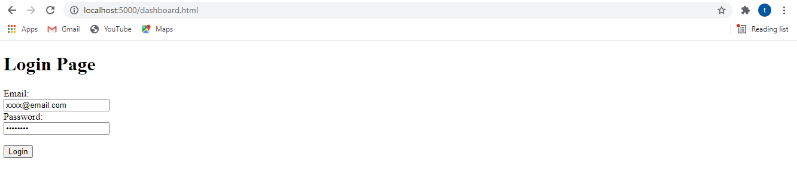

# is601Final
This project create a flask applicaiton which is based on lesson4 project and mix with tutorial from this link :https://hackersandslackers.com/your-first-flask-application
1. See project 3 in the link here : https://github.com/jinhongtan/lesson4.git# 
# How to run the project

1. Clone the GitHub repo use the command "git clone https://github.com/jinhongtan/is601Final"
2. Open your terminal and change into the project directory
3. Run the command "docker-compose build" without the quotation marks. Wait until the services finish building; it shouldn't take longer than a couple minutes.
4. Once the build is done, run the command "docker-compose up" to bring up the services. Again, this should take about a minute.
5. Open a browser, and go to localhost:5000. This will open the project, and you will be able to view it. Note that in order to edit, add or delete records, you will need to be logged in. Create an account at the top of the page, and then log in.
6. When you are done, run "docker-compose down". This will stop all the containers and remove the images. Note that you may have to hit "Ctrl + C" on the keyboard in order to type 7. anything on the command line. Alternatively, you could open a new window or tab in the command line, or another CLI interface of your choice. Personally, I use Windows Terminal, but there is also Terminal if you are using a Mac, or Windows PowerShell if you are on Windows.
8. Login page

